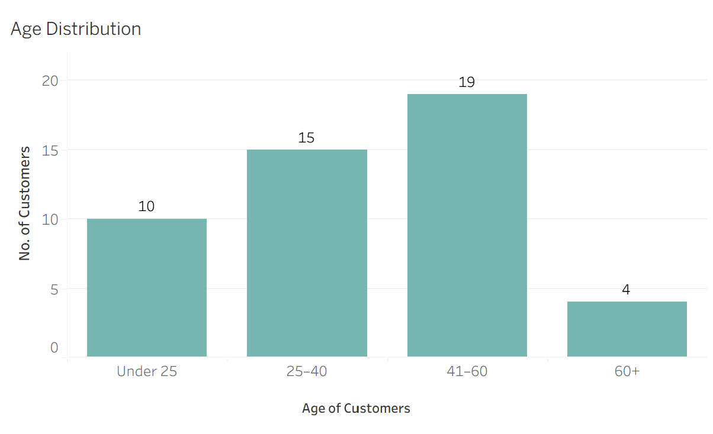
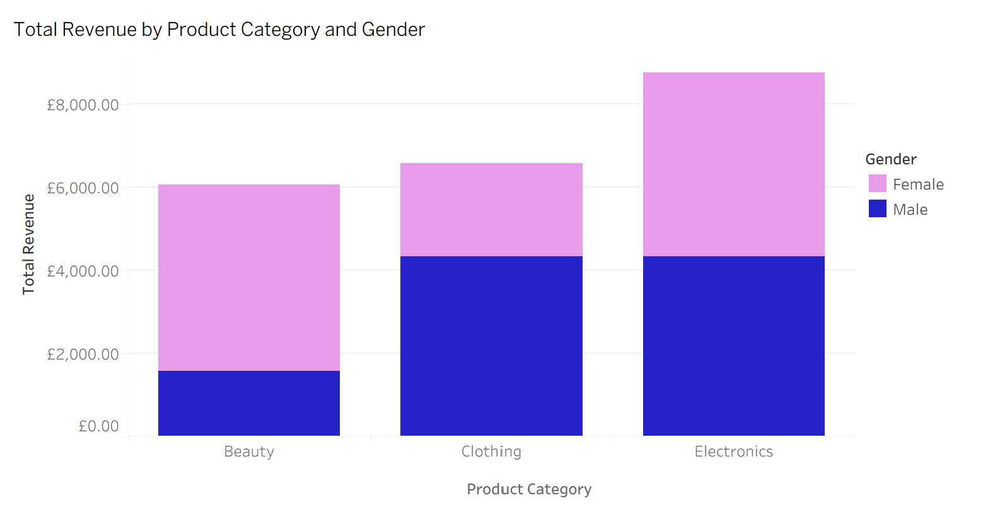
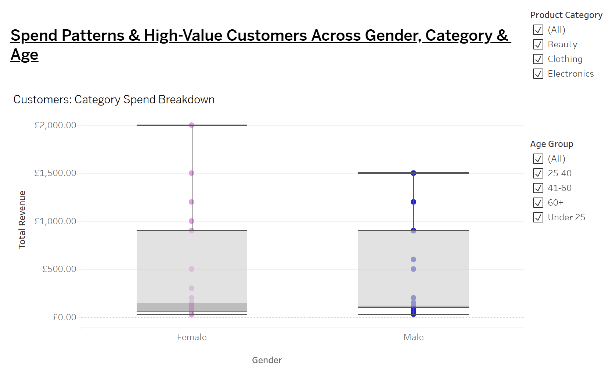
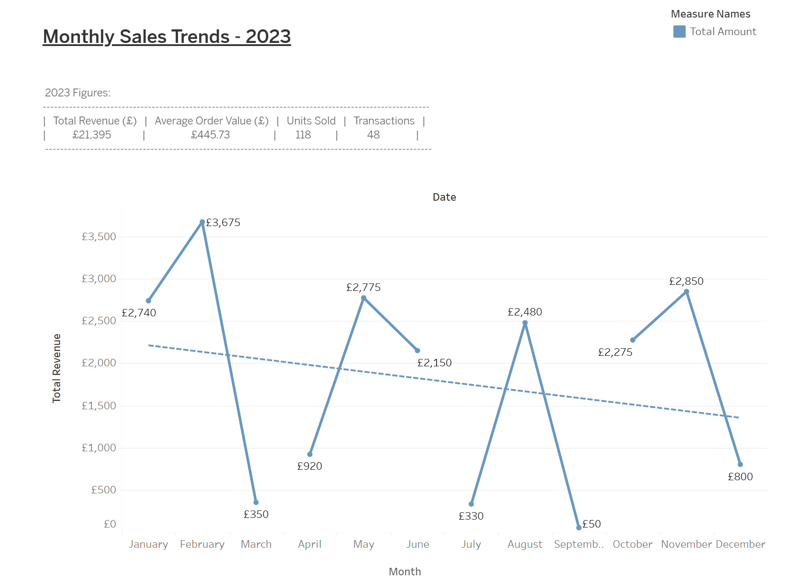

This project investigates key business questions around customer behaviour, demographic patterns and revenue drivers within a retail dataset. To support the visualisations built in Tableau, I developed a series of SQL queries that aggregated the data to reveal meaningful trends. The examples below highlight how SQL was used to generate insights and how these outputs directly informed the dashboards.

An interactive Tableau Story exploring customer demographics, product performance, customer value, and monthly sales trends across a retail dataset. 
https://public.tableau.com/views/RetailAnalyticsPortfolio-Maria/RetailDemographicsPortfolio-Maria?:language=en-GB&:sid=&:redirect=auth&:display_count=n&:origin=viz_share_link

Question 1: Who are the customers? What do they look like demographically?

SQL Example: Customer Age Distribution (binned)

- The intended result was to understand the shape of the customer profile, by grouping individual ages into bins. The bar chart shows the numbers of customers within the dataset, and these customers are grouped into four age clusters —Under 25, 25–40, 41–60, and 60+. These cluster groups were chosen to reflect meaningful life stages and purchasing behaviours.The ranges align with common demographic segments used in retail and marketing analysis.
- Creating these age clusters made it easier to see which age clusters are over/under-represented. Binning reduced noise and produced a cleaner dataset, allowing the visualisation to display one bar per age group.
- Customers aged 41–60 generated the highest share of sales at 40%, followed by the 25–40 segment. This suggests that the product range appears to resonate more with middle-aged customers, but younger adults also represent a strong secondary market. The younger segments make up for 52.1% of customers, these age groups are typically more responsive to new product launches and social media influencing that make them ideal for target marketing.
- They also naturally gravitate towards product categories which are trend-driven or lifestyle-oriented, which the product category offering is Beauty, Electronics, and Clothing. The strong representation of middle-aged customers suggest they have greater financial stability and purchasing power, making them a commercially valuable segment. 

Question 2: What categories drive revenue? How does this differ by gender?

SQL Example: Total Revenue by Product Category

- The visualisation shows one bar per category to show total revenue, with colour-coded gender segments to show which customer group purchased the most from each category.
- The intended result was to see which product categories generated the most revenue, and what was the financial contribution of each one. Also aiming to understand how spending differed between Men and Women, so the query aggregated revenue by both category and gender.
- Women drove the highest revenue within the Beauty category, which reflects strong engagement with cosmetic products and self-care. In contrast, men generated more revenue in Electronics and Clothing, this indicates a preference for tech-led and apparel-based purchases. These patterns highlight clear gender-based category behaviours, suggesting opportunities to tailor strategies across marketing and product positioning to each demographic. 

Question 3: Which product category has the widest spend range by gender? Do older age groups show more high-value outliers?

SQL Example: Customer Spend Summary

- The box-and-whisker plot highlights the difference in spend range, median values, and high-value outliers. Overall, this helps to identify which segments show the widest variation in spending and where high-value customers are concentrated.
- The Beauty segment is shown to have the widest spend range for female customers, yet the Electronics segment includes females with an exceptionally high spend - with the upper whisker reaching £2,000. This indicates fewer but more extreme high-value purchases in the category.
- Among male customers, the Electronics segment shows the widest spend range. It includes more high spenders, and suggests opportunities for targeted premium product marketing. The Clothing segment amongst men suggests there is diverse spending behaviour with some customers making high-value purchases, whereas others are spending more conservatively.
- When filtering by Age group, the 41-60 and 60+ age groups contain more frequent high-value purchases, particularly in the Beauty and Clothing segments. Male customers that fall within these age groups have a higher median spend at £600, than female customers at £125, indicating a presence of higher spenders within the older age groups. For older women there is a moderate median spend but strong outlier presence in the Beauty segment, suggesting the opportunity for targeting upselling strategies to this customer type. 

Question 4: What seasonal patterns or fluctuations are evident in monthly revenue performance?

SQL Example: Monthly Sales Trend

The visualisation shows month-to-month trends clearly, and from here key insights around missed opportunities are indentifyable. A best fit line was added into the chart to highlight the overall trend in sales performance throughout the year. It shows a clear visual summary of the underlying direction, revealing that 2023 sales showed strong momentum in Q1 and a recovery in Q4. This query aggregated total revenue by month to understand how sales fluctuated across the year. The intended result was to identify seasonal patterns, growth periods, and months where revenue saw a significant rise or fall. By grouping sales at monthly level, the analysis produced a clean time-series dataset that could be represented as a line chart. 

Results shows mid‑year volatility and the declining trend suggest market saturation, reduced promotional activity in later months, and diminishing customer retention. This signals opportunities for stronger engagement and retention strategies.
Top performance: February (£3,675), May (£2,775), and November (£2,850) drove the bulk of revenue.
Underperformance: March (£350), July (£330), and September (£50) suggest missed opportunities or operational gaps.

Huge gaps in months - why? Why were there not enough sales in July? 

Summary:

This project has brought together SQL, Tableau, and analytical reasoning to explore key questions around customer behaviour, revenue drivers, and demographic patterns in UK retail. Across the dashboards, clear trends have emerged, which have included seasonal revenue fluctuations, concentrated customer value, and distinct purchasing differences across demographics and product categories.

