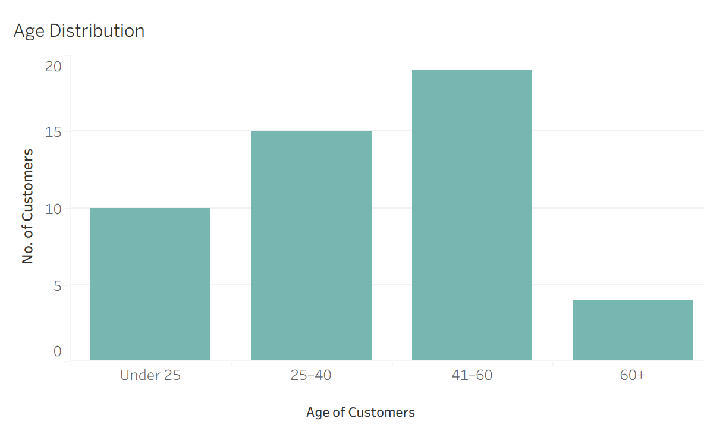
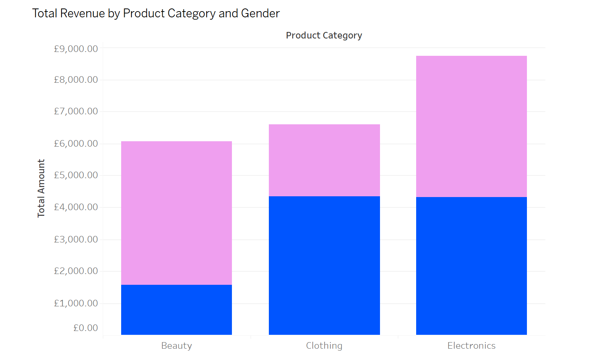
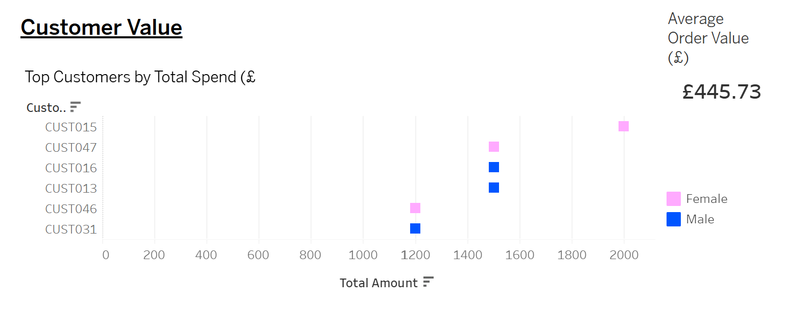
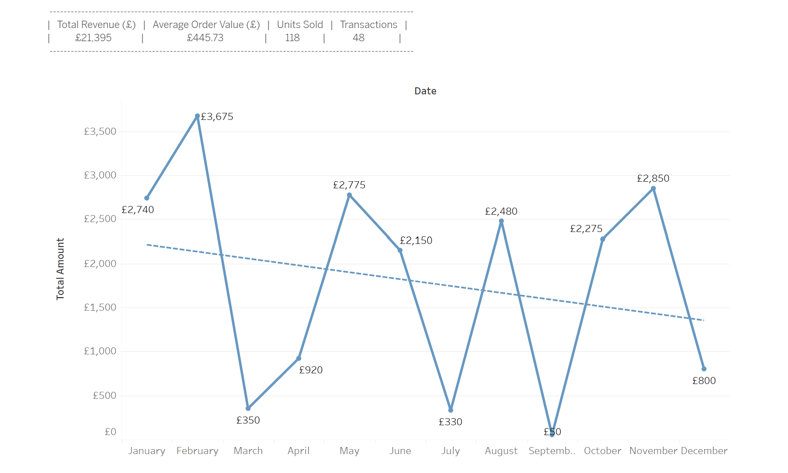

This project investigates key business questions around customer behaviour, demographic patterns and revenue drivers within a retail dataset. To support the visualisations built in Tableau, I developed a series of SQL queries that aggregated the data to reveal meaningful trends. The examples below highlight how SQL was used to generate insights and how these outputs directly informed the dashboards.

An interactive Tableau Story exploring customer demographics, product performance, customer value, and monthly sales trends across a retail dataset. 
https://public.tableau.com/views/RetailAnalyticsPortfolio-Maria/RetailDemographicsPortfolio-Maria?:language=en-GB&:sid=&:redirect=auth&:display_count=n&:origin=viz_share_link

Question 1: Who are the customers? What do they look like demographically?

Customer Demographics Dashboard - Age Distribution Visualisation

SQL Example: Customer Age Distribution (binned)

The goal was to understand the shape of the customer profile, by grouping individual ages into bins. Creating these age clusters made it easier to see which age clusters are over/under-represented. Binning reduced noise and produced a cleaner dataset, allowing the visualisation to display one bar per age group. Customers aged 41–60 generated the highest share of sales at 40%, followed by the 25–40 segment. This suggests that the product range appears to resonate more with mid‑life customers, but younger adults also represent a strong secondary market. 

Question 2: What categories drive revenue? How does this differ by gender?

Product Category Performance Dashboard - Total Revenue by Product Category and Gender Visualisation

SQL Example: Total Revenue by Product Category

The goal was to see which product categories generated the most revenue, and what was the financial contribution of each one. I also wanted to understand how spending differed between Men and Women, so the query aggregated revenue by both category and gender. This informed the visualisation by producing one bar per category to show total revenue, with colour-coded gender segments to show which customer group purchased the most from each category. Women drove the highest revenue within the Beauty category, which reflects strong engagement with cosmetic products and self-care. In contrast, men generated more revenue in Electronics and Clothing, this indicates a preference for tech-led and apparel-based purchases. These patterns highlight clear gender-based category behaviours, suggesting opportunities to tailor strategies across marketing and product positioning to each demographic. 

Question 3: Who are the highest-value customers? What is the typical order worth?

Customer Value Dashboard - Top Spending Customers Visualisation

SQL Example: Top Spending Customers

The goal was to identify the highest-value customers by calculating total spend per customer across all orders, highlighting which individuals contribute the most revenue and to understand the distribution of customer value within the dataset. Aggregating spend at customer level created a ranked list of top spending customers, which contributed to the visualisation by showing the highest-value customers and their total revenue contribution, with colour-coded marks indicators to show how spending varied amongst Men and Women. Note: Although the query was designed to return the top 5 spending customers, the visualisation displays 6 due to a tie in total revenue between the 5th and 6th customers. This ensures the chart reflects all customers who share the same top‑spending rank. The Top six customers each spent between £1,200 and £2,000. The Gender distribution among these high spenders is mixed, indicating both male and female customers contribute significantly to top-line revenue. Monitoring customer behaviours over time could help identify patterns in seasonal spend and product preference. These insights can also inform strategy around loyalty incentives and personalised offers in order to retain high-value customers and encourage repeat purchasing. 

Question 4: How does revenue fluctuate across the year?

Monthly Sales Trend Dashboard - Line Chart Visualisation

SQL Example: Monthly Sales Trend

This query aggregated total revenue by month to understand how sales fluctuated across the year. The goal was to identify seasonal patterns, growth periods, and months where revenue saw a significant rise or fall. By grouping sales at monthly level, the analysis produced a clean time-series dataset that could be represented as a line chart. The visualisation showed month-to-month trends clearly, and from here I was able to highlight key insights around missed opportunities. I added the best fit line into the chart to highlight the overall trend in sales performance throughout the year. It shows a clear visual summary of the underlying direction, revealing that 2023 sales showed strong momentum in Q1 and a recovery in Q4. Mid‑year volatility and the declining trend suggest market saturation, reduced promotional activity in later months, and diminishing customer retention. This signals opportunities for stronger engagement and retention strategies.
Top performance: February (£3,675), May (£2,775), and November (£2,850) drove the bulk of revenue.
Underperformance: March (£350), July (£330), and September (£50) suggest missed opportunities or operational gaps.

Summary:

This project has brought together SQL, Tableau, and analytical reasoning to explore key questions around customer behaviour, revenue drivers, and demographic patterns in UK retail. Across the dashboards, clear trends have emerged, which have included seasonal revenue fluctuations, concentrated customer value, and distinct purchasing differences across demographics and product categories.

