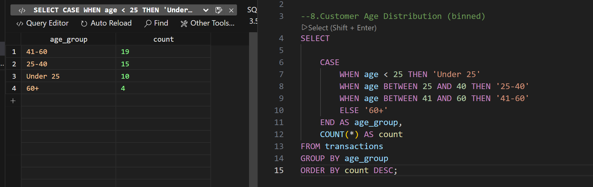
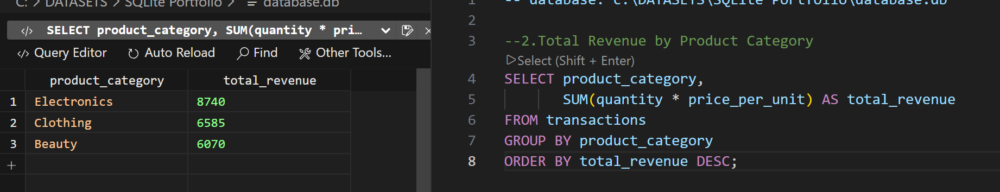
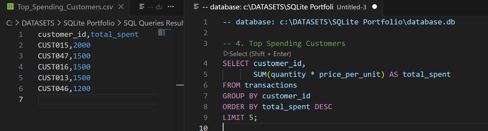
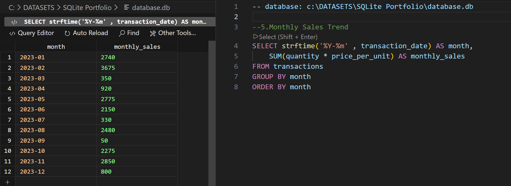

Portfolio project combining Tableau dashboards, SQL queries, and upcoming Python analysis to explore UK retail insights.

To answer the key business questions explored in my Tableau visualisations, I ran a series of SQL queries to explore customer behaviour, revenue drivers, and demographic patterns.
Below are four representative examples showing how I used SQL to generate insights and how these results informed the dashboards.

UK Retail Insights – Tableau Portfolio
An interactive Tableau Story exploring customer demographics, product performance, customer value, and monthly sales trends across a UK retail dataset. 
https://public.tableau.com/views/RetailAnalyticsPortfolio-Maria/RetailDemographicsPortfolio-Maria?:language=en-GB&:sid=&:redirect=auth&:display_count=n&:origin=viz_share_link

Question 1: Who are the customers? What do they look like demographically?
Customer Demographics Dashboard - Age Distribution Visualisation
SQL Example: Customer Age Distribution (binned)

The goal was to understand the shape of the customer profile, by grouping individual ages into bins. Creating these age clusters made it easier to see which age clusters are over/under-represented. Binning reduced noise and produced a cleaner dataset, allowing the visualisation to display one bar per age group. 

Question 2: What categories drive revenue? How does this differ by gender?
Product Category Performance Dashboard - Total Revenue by Product Category and Gender Visualisation
SQL Example: Total Revenue by Product Category

The goal was to see which product categories generated the most revenue, and what was the financial contribution of each one. I also wanted to understand how spending differed between Men & Women, so the query aggregated revenue by both category and gender. This informed the visualisation by producing one bar per category to show total revenue, with colour-coded gender segments to show which customer group purchased the most from each category. 

Question 3: Who are the highest-value customers? What is the typical order worth?
Customer Value Dashboard - Top Spending Customers Visualisation
SQL Example: Top Spending Customers

The goal was to identify the highest-value customers by calculating total spend per customer across all orders, highlighting which individuals contribute the most revenue and to understand the distribution of customer value within the dataset. Aggregating spend at customer level created a ranked list of top spending customers, which contributed to the visualisation by showing the highest-value customers and their total revenue contribution, with colour-coded marks indicators to show how spending varied amongst Men & Women. Note: Although the query was designed to return the top 5 spending customers, the visualisation displays 6 due to a tie in total revenue between the 5th and 6th customers. This ensures the chart reflects all customers who share the same top‑spending rank.

Question 4: How does revenue fluctuate across the year?
Monthly Sales Trend Dashboard - Line Chart Visualisation
SQL Example: Monthly Sales Trend

This query aggregated total revenue by month to understand how sales fluctuated across the year. The goal was to identify seasonal patterns, growth periods, and months where revenue saw a significant rise or fall. By grouping sales at monthly level, the analysis produced a clean time-series dataset that could be represented as a line chart. The visualisation showed month-to-month trends clearly, and from here I was able to highlight key insights around missed opportunities.

